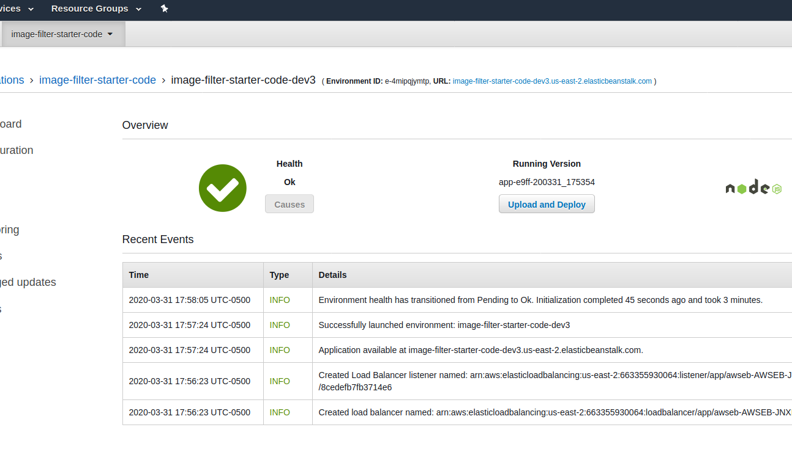
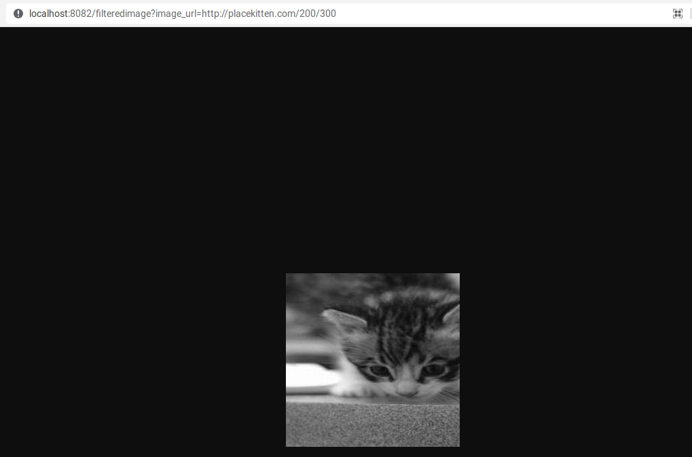

# Image Filter Microservice
> Udacity Cloud Developer, March 31, 2020

Endpoint URL: http://image-filter-starter-code-dev3.us-east-2.elasticbeanstalk.com/ (does not work)

## Successful Deployment



To get started

```bash
yarn install

yarn run dev
```

```bash

curl http://localhost.8082/filteredimage

curl http://localhost:8082/filteredimage?image_url=http://placekitten.com/200/300
```

Running the first command will return invalid because it is looking for an image url.

The last command should return something like this.

